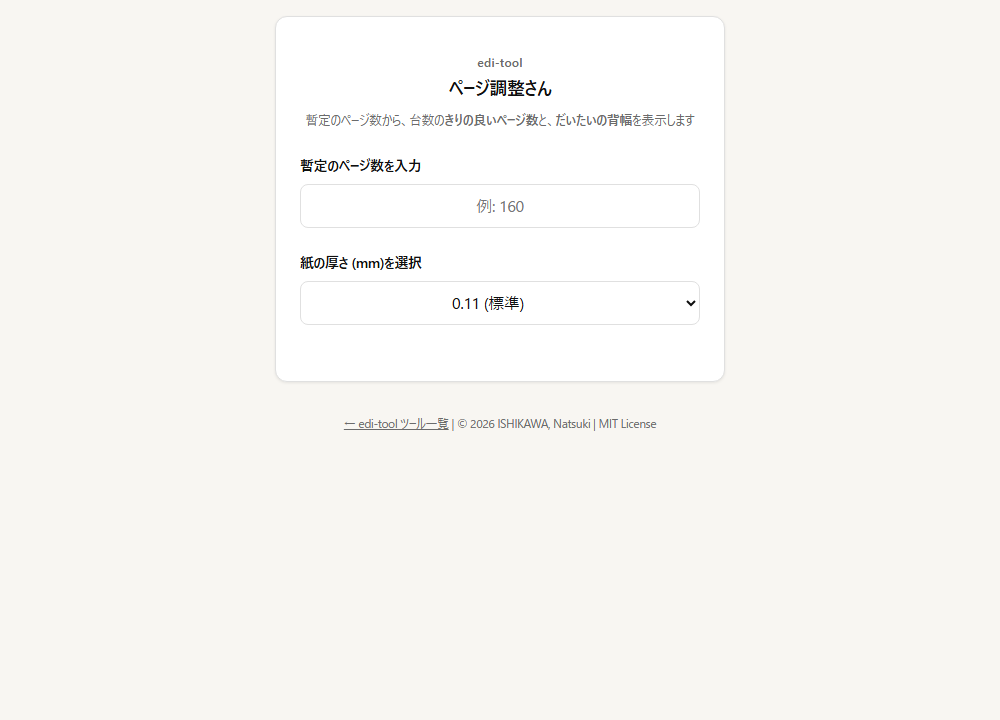

# ページ数最適化・背幅概算ツール（ページ調整さん）

暫定のページ数を入力すると、台割りに合う切りの良いページ数を提案し、背幅を概算するツールです。編集工程での使用を想定しています。

🔗 https://edi-tool.github.io/page-count/



## 使い方

1. 暫定のページ数を入力する（全角数字も可）
2. 紙の厚さ（0.09〜0.15mm）を選ぶ
3. 16 ページ（全台）・8 ページ（半台）刻みの前後の案と、それぞれの背幅が表示されます。増減が少ないほうに「近い」が付きます

## データの扱い

- 入力した数値はブラウザ内で計算し、外部へ送信しません。
- 外部ライブラリは使用していません（依存なしの Vanilla JavaScript）。

## 仕様・計算根拠

### 1. ページ数の最適化

商業誌の印刷で一般的な「16ページ（全台）」および「8ページ（半台）」刻みを基準に、入力されたページ数に近い「キリの良いページ数」を算出します。

### 2. 背幅計算

以下の計算式に基づき、並製本（無線綴じ）の概算背幅を表示します。

- `(ページ数 ÷ 2) × 紙の厚さ ＋ 0.8mm（表紙・糊代の補正）`

※ 0.8mm の補正値は、一般的な推奨値に基づいています。

## 制限事項

- 背幅はあくまで概算です。用紙銘柄・製本方法・表紙の厚さで変わるため、入稿前に印刷所の束見本・計算値で確認してください。
- 上製本（ハードカバー）の計算には対応していません。

## 開発

ビルド工程はありません。`index.html` をそのまま GitHub Pages が配信します。

```bash
python -m http.server 8000   # プレビュー
npm test                     # テスト（Node.js 22 以上、依存パッケージなし）
npm run check                # HTML の静的チェック
```

- テストは `index.html` を変更せずに計算関数を取り出して実行し、上記の計算式と刻みを確認します（`tests/`）。計算式を変えたら README とテストを同時に更新してください。
- 変更履歴は [CHANGELOG.md](CHANGELOG.md) を参照してください。
- 開発方針は [edi-tool 開発原則](https://github.com/edi-tool/.github/blob/main/PRINCIPLES.md) に従います。

## 参考文献 / References

本プロジェクトの開発にあたり、以下の資料およびデータを参照・利用させていただきました。

### デザイン

- [kzhrknt/awesome-design-md-jp](https://github.com/kzhrknt/awesome-design-md-jp)
  - 本ツール（index）のデザインの参考

## 関連ツール

- [表記統一さん](https://edi-tool.github.io/hyoki-checker/) — 表記ゆれの検出
- [edi-tool のツール一覧](https://edi-tool.github.io/)

## ライセンス

MIT License © 2026 ISHIKAWA, Natsuki（[LICENSE](LICENSE)）
